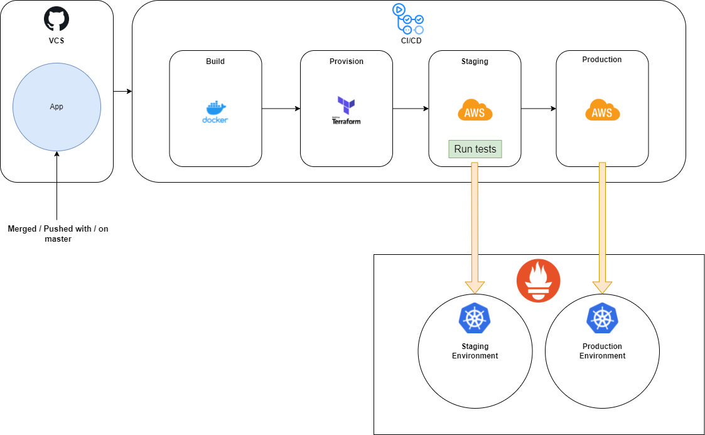

# Conceptdiagramm

# Decisions and Why

- GitHub (*VCS*)

GitHub will allow developers to make changes to code, to push this code to the repository and to control the versions of the app. Developers can work on different components in one repository and merge the changes to the main branch. 

GitHub is probably the most popular version control software development tool.

- GitHub Actions (*CI/CD*)

CI stands for "Continuous Integration" and CD for "Continuous Development". This tool allows DevOps Engineers to write and run the pipeline that executes actions for the developed app. Generally, this tool is the main mechanism that automates the deployment from the repository to the server and to the enduser. 

GitHub Actions is simple to get started and has all necessary templates for the services we will use for the deployment.

- Docker (*Containerization*)

In order to deploy the app on a server, we need a containerization tool, that will install all dependencies and pack it all together in the container. 

Docker is well known and has a solid support in the internet.

- Terraform (*Provision*)

Terraform is a tool for infrastracture provisioning and is widely used for its declarative nature. In other words, it provides the environment setup for the deployed app. The declarative nature means, that DevOps engineer specifies the end result and terraform will perform all the steps automatically, rather then write each step and how to execute these steps manually. 

Terraform is good for splitting up the environments, i.e. staging and production environments.

- Amazon Web Services (*Cloud Provider*)

Cloud provider contains the operation system with the deployed app and installed Container Orchestration tool. Generally speaking, it is the server that will be reached by the users of the application. Cloud providers have scalable infrastructure and good uptime / stability. 

Amazon Web Services (AWS) has a huge amount of datacenters. Services available on AWS is extremely broad and wide. These various services are really well integrated, and they provide a very comprehensive cloud service.

- Kubernetes (*Container Orchestration*)

Container Orchestration tool balances the load on the servers of the deployed app. It "orchestrates" the pods (wraps around the container, could be 1 or more containers in one pod) to equally divide the load of the microservices on the server.

Kubernetes offers portability, and faster, simpler deployment times. It is a stable, reliable, easy-to-use solution. Simply, it's the best way to deploy containers.

- Prometheus (*Monitoring*)

In order to look out for the applications health and to detect errors we need the monitoring tool. It checks memory usage, speed and other essential app components and notifies the administrator about vulnerabilities.

Prometheus contributes to the DevOps system by monitoring cloud-native applications and infrastructure, and by watching over hundreds of microservices. Prometheus monitoring eliminates the amount of alerts in a system, only sending alerts when major issues need to be solved.

# Infrastructure archirecture

There are **2 containers** running on the **3 Ubuntu Server** machines in aws. 

- **first container** is for the node application itself
- **second container** is for the mongoDB database
- **first aws server** is for the Master node of Kubernetes
- **second and third aws servers** are for the Kubernetes workers

# Automation steps

After merge request or push to the master branch in the app repository following automation steps are taking place:

- build the app with makefile into one artefact
- containerize the app and the database
- provide infrastructure with terraform (2 environments - staging and production with Kubernetes and docker installed)
- deploy the app to the aws staging servers that were provided by the terraform
- test the environment
- deploy the tested app to the production environment (no downtime)
- monitor the servers
- repeat the process